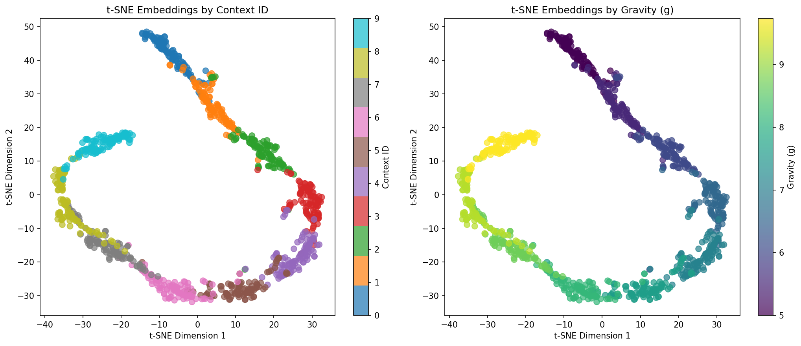

# Contrastive Trajectory Encoders for Zero-Shot Adaptation in CMDPs

A research framework for learning context-aware RL policies through self-supervised contrastive learning on trajectory dynamics.

## Overview

This project implements a two-phase training pipeline:
- **Phase 1 (The "Eye")**: Learn trajectory embeddings via contrastive learning (SupConLoss)
- **Phase 2 (The "Brain")**: Train context-conditional policies using the learned embeddings

## Latest Results (January 19, 2026)

### Embedding Visualization



*Left: Embeddings colored by context ID showing clear cluster separation. Right: Embeddings colored by gravity parameter (g) showing smooth gradient in embedding space.*

### Training Performance

| Metric | Value | Description |
|--------|-------|-------------|
| **Intra-context similarity** | 0.95 | Trajectories from same gravity cluster tightly |
| **Inter-context similarity** | 0.03 | Different gravity settings are nearly orthogonal |
| **Separation score** | 0.92 | Excellent discriminability between contexts |
| **Silhouette score** | 0.42 | Good clustering quality |
| **Davies-Bouldin score** | 0.73 | Reasonable cluster compactness |

### Training Configuration

- **Environment**: CARL-Pendulum with varying gravity (g = 5.0 to 10.5)
- **Contexts**: 10 different gravity settings
- **Segments**: 100 per context (1000 total)
- **Loss**: Supervised Contrastive Loss (SupConLoss)
- **Epochs**: 50
- **Batch size**: 64
- **Encoder**: Bidirectional LSTM (256 hidden, 64 latent dim)

### Key Observations

1. The encoder successfully learns to distinguish pendulum dynamics under different gravity values
2. Embeddings form a smooth manifold where gravity increases along the curve
3. High intra-class similarity (0.95) indicates consistent representation within each context
4. Near-zero inter-class similarity (0.03) shows excellent discrimination between contexts

## Project Structure

```
rl_encoder/
├── src/
│   ├── data/              # Data collection and trajectory generation
│   ├── models/            # Encoder and policy architectures
│   ├── training/          # Training loops for both phases
│   ├── evaluation/        # Metrics and visualization
│   └── utils/             # Helper functions
├── configs/               # Experiment configurations
├── experiments/           # Saved models, logs, embeddings
├── scripts/               # Entry points for training/evaluation
└── requirements.txt       # Dependencies
```

## Installation

```bash
pip install -r requirements.txt
```

## Quick Start

### Phase 1: Train Trajectory Encoder

```bash
python scripts/train_encoder.py --config configs/encoder_config.yaml
```

### Phase 2: Train Context-Conditional Policy

```bash
python scripts/train_policy.py --config configs/policy_config.yaml --encoder-path experiments/encoder_best.pt
```

### Evaluate Zero-Shot Performance

```bash
python scripts/evaluate.py --policy-path experiments/policy_best.pt --encoder-path experiments/encoder_best.pt
```

## Baselines

- **Standard PPO**: Context-blind policy trained across all environments
- **Oracle PPO**: Policy with ground-truth context labels (upper bound)

## Key Features

- Support for CARL environments (Pendulum, CartPole, Ant, HalfCheetah)
- Flexible encoder architectures (LSTM, Transformer)
- Multiple contrastive losses (SupConLoss, InfoNCE, TripletLoss)
- Data augmentation for better positive pair generation
- t-SNE visualization of learned embeddings
- Integration with Stable-Baselines3
- Comprehensive evaluation metrics (silhouette, Davies-Bouldin, separation score)

## Research Context

This implementation is based on the principle that trajectories from the same environment (same physics parameters) should produce similar embeddings, while trajectories from different environments should be distinguishable. This enables zero-shot adaptation to novel contexts without explicit labels so the anchor and postive are closer together and negative is further apart

## Citation

If you use this code in your research, please cite:
```bibtex
@misc{contrastive_trajectory_encoders,
  title={Contrastive Trajectory Encoders for Zero-Shot Adaptation in CMDPs},
  author={Your Name},
  year={2026}
}
```
